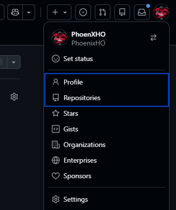
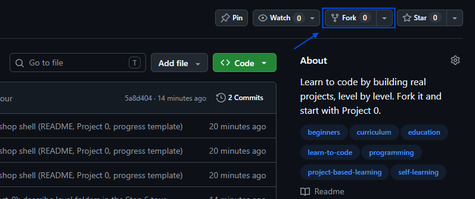
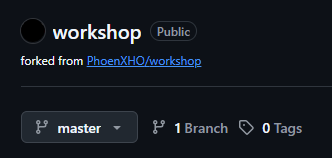
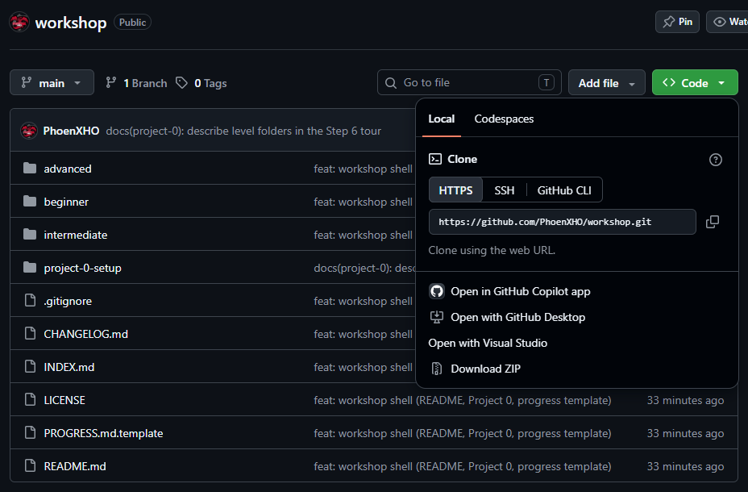
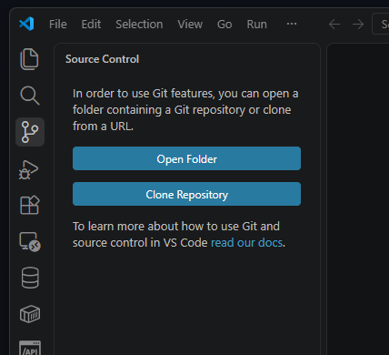
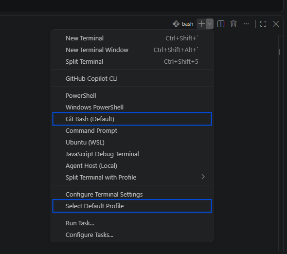
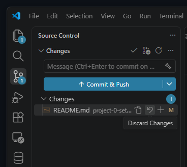

# Project 0: Setup

> - **What you'll learn:** Version control (Craft)
> - **Achievements in this project:** 1
> - **Covers:** Windows, macOS, and Linux

This project has no code in it. It covers the things that need to happen exactly once before real coding can start, and once it's done you won't have to think about it again: you'll make an account, install the two programs the workshop uses, get your own copy of it onto your machine, and save your first piece of work the way programmers save everything.

There are ten steps, and they go in order. Each one ends with a checkpoint, which is a small thing you can look at to confirm the step worked, so you never move on wondering whether you did it right. The instructions cover all three operating systems side by side: when a step depends on your computer, you'll see every version with its name on it, so read yours and skip the others. You'll also be clicking around GitHub as you read, so it helps to keep these instructions in one tab and do the clicking in another.

## The steps

1. [Create your GitHub account](#step-1-create-your-github-account)
2. [Get your own copy](#step-2-get-your-own-copy)
3. [Install git](#step-3-install-git)
4. [Install VS Code](#step-4-install-vs-code)
5. [Get the workshop onto your machine](#step-5-get-the-workshop-onto-your-machine)
6. [Know your way around](#step-6-know-your-way-around)
7. [Start your PROGRESS.md](#step-7-start-your-progressmd)
8. [When new projects appear](#step-8-when-new-projects-appear)
9. [When something goes wrong](#step-9-when-something-goes-wrong)
10. [You're ready](#step-10-youre-ready)

## Step 1: Create your GitHub account

GitHub is a website where programmers keep their code, and it's where this whole workshop lives. Everything you build here will live there too, under your name, so the first thing you need is an account. If you already have one, sign in and skip ahead; nothing else in this step applies to you.

Go to [github.com](https://github.com) and click **Sign up**. The form asks for an email address, a password, and a username. The username is the only one worth thinking about for a second, because it becomes part of the address of everything you put there: `github.com/[yourname]`. Pick something you wouldn't mind showing a stranger. You can rename things later, but starting with something reasonable saves you the trouble. Along the way GitHub may ask you to verify your email or solve a small puzzle to prove you're a person; do what it asks, and when it lets you in, this step is done.

Before moving on, get your bearings. Once you're signed in, your profile picture sits in the top right corner of GitHub, and clicking it opens a menu with **Profile** and **Repositories** in it. Nearly everything you do on GitHub starts from that corner, and you'll be back in it constantly.



**Checkpoint:** you're signed in, and clicking your profile picture and then **Profile** shows a page with your username on it. It looks empty for now, and that changes soon.

## Step 2: Get your own copy

On GitHub, a project lives in what's called a repository, or repo for short: one place that holds the project's files together with the full history of every change made to them. This workshop is a repo, and at the moment there is exactly one of it, mine. You won't work in mine; you'll make your own copy under your account, and GitHub has a button for that. Making your own copy is called forking, and a fork is your own copy of someone else's repo, identical to the original when you make it and entirely yours after that. Everything you do in this workshop happens in your fork.

First, get back to the repo's front page. At the top of this page, above the project title, you'll see the workshop's name; click it and you're there. Find the **Fork** button in the top right and click it.



GitHub shows you a short page asking where the copy should go. Leave everything as it is and confirm. After a few seconds you land on a page that looks exactly like the one you just left, with one difference: the address bar now says `github.com/[yourname]/workshop` instead of mine. Under the repo's name it also says *forked from* followed by my username, which is how GitHub remembers where your copy came from. That detail matters later, when I publish new projects or fixes and your copy can pull them in.



From here on, when this workshop says *your repo*, it means that fork.

**Checkpoint:** the address bar of your repo page starts with `github.com/` followed by your username, and the page says *forked from* mine.

## Step 3: Install git

git is the program that runs underneath every repo. It records every change made to the files in it, which is what makes comparing versions, undoing mistakes, and recovering work possible. You'll use it constantly from Step 7 onward.

You'll check that it worked from a terminal, a window where you type commands and press Enter instead of clicking. If you've never used one, the Windows and macOS sections below show you how to open it.

### Windows

Open [git-scm.com/install/windows](https://git-scm.com/install/windows) and click the download link at the top of the page. Run the file you downloaded and click Next through the installer; every default is fine. The installer also adds a program called **Git Bash**, a terminal for Windows that behaves like the terminals on macOS and Linux. You'll use it briefly in this step, and in Step 7 it moves into VS Code and stays there.

### macOS

Press `Cmd + Space`, type `Terminal`, and press Enter, then type `git --version`. If git isn't installed yet, a window will pop up offering to install the Command Line Developer Tools. That's git. Click **Install** and let it finish, then run the command again.

### Linux

Install git with your distribution's package manager. [git-scm.com/install/linux](https://git-scm.com/install/linux) lists the command for each one; on Ubuntu, for example, it's `sudo apt install git`.

**Checkpoint:** in a terminal (Git Bash on Windows), typing `git --version` and pressing Enter answers with a version number.

## Step 4: Install VS Code

The second program is VS Code, a code editor: a text editor built for programming. It colors code so you can tell the parts apart at a glance, it warns you when something looks off, and it can open a whole folder at once and list every file in it down the side of the window. You'll write everything you build in this workshop inside it.

### Windows

Open [code.visualstudio.com](https://code.visualstudio.com) and click the download button; the site knows what system you're on and gives you the right file. Run it and click Next through the installer.

### macOS

Download VS Code from [code.visualstudio.com](https://code.visualstudio.com), open the downloaded file, and drag Visual Studio Code into your Applications folder. Launch it from there like any other app.

### Linux

[code.visualstudio.com/download](https://code.visualstudio.com/download) offers a package for each major distribution; grab the `.deb` for Ubuntu and its relatives, or the `.rpm` for Fedora, and install it the way you install anything else.

**Checkpoint:** VS Code opens on your machine. It greets you with a welcome tab full of options; you don't need any of them yet, and it's safe to close the tab. Leave VS Code itself open; the next step puts it to work.

## Step 5: Get the workshop onto your machine

Your fork lives on GitHub. To work on the workshop you need it on your own machine, and git's word for that is a clone: a full copy of a repo on your computer, connected to your fork so that work can move between the two. You'll do all your building in the clone, and finished work travels from it up to your fork.

First you need your fork's address. On your repo's page on GitHub, click the green **Code** button and copy the address under HTTPS; it reads `https://github.com/[yourname]/workshop.git`.



Then clone it from VS Code. Click the **Source Control** icon in the bar on the far left of the window, the one that looks like a branching line, and click **Clone Repository**.



Paste the address you copied and press Enter. VS Code asks where the workshop should live on your machine, and the choice is worth a moment of thought: it creates a new folder named `workshop` inside whatever folder you pick, and a clone that lands in the wrong place is annoying to move later. Choose somewhere you'll remember. If you don't have an opinion yet, your Documents folder is a fine home. After you choose, VS Code downloads the workshop, and when it asks whether to open the folder it just created, say yes. The same job from a terminal is `git clone` followed by the address, run from whatever folder you want the workshop folder to end up inside.

**Checkpoint:** the Explorer, the top icon in VS Code's left bar, now lists the workshop's files, and you can find this very page among them at `0-setup/README.md`.

## Step 6: Know your way around

Take a moment with the file list in VS Code's Explorer, because knowing what you're looking at saves confusion later. Folders come first in that list, and each project lives in its own folder: `0-setup` is this one. The three level folders, `1-beginner`, `2-intermediate`, and `3-advanced`, are where each level's projects live as the workshop grows. Below the folders sit the files that belong to the workshop itself: `README.md` is the front door you came through, `INDEX.md` is the catalog of every project, `CHANGELOG.md` records what's new each time the workshop changes, `LICENSE` says what anyone is allowed to do with all of this, `.gitignore` is a small settings file telling git which files never to track, and `PROGRESS.md.template` is the blank your own `PROGRESS.md` gets copied from in the next step.

Everything in that list also lives on your repo's page on GitHub. Your clone and your fork are the same workshop in two places, one on your machine and one on GitHub, and by now you can find your way around both.

A habit worth picking up now that you can see these files as files: read the workshop on GitHub, in your browser, where pages render properly and anything meant to stay folded stays folded, and use VS Code for writing. The text is the same either way; it just reads better rendered.

You'll also never have to guess where your work goes. Every exercise starts by naming the file it happens in, and your own files, beginning with `PROGRESS.md` in the next step, grow alongside the workshop's. And if you ever edit a workshop page by accident, Step 9 shows how to put it back as it was.

**Checkpoint:** looking at the Explorer list, you can say what `0-setup/` is and what each of the workshop's files is for.

## Step 7: Start your PROGRESS.md

Now you'll make your first commit. A commit is a saved moment in a repo: you choose the files you want to save, git stores them together with a short message describing what you did, and from then on you can always come back to this state. Everything you ever save in this workshop gets saved as a commit.

First, the file. In VS Code's Explorer, right-click `PROGRESS.md.template` and choose **Copy**, then right-click the empty space below the file list and choose **Paste**. A duplicate appears; right-click it, choose **Rename**, and make its name exactly `PROGRESS.md`. Open it and look around: it holds the three sections you read about on the workshop's front page, each with a short note showing what goes in it. You'll fill them in as you earn things.

Then open a terminal without leaving VS Code. Press `` Ctrl + ` `` (the backtick key, left of the 1) or pick **Terminal → New Terminal** from the menus, and a terminal opens along the bottom of the window. On Windows it may start as PowerShell; click the small dropdown arrow next to the plus sign in the terminal panel's top corner and pick **Git Bash**, and if you want that to be permanent, the same dropdown has a **Select Default Profile** option worth clicking. From here on, this built-in terminal is the workshop's terminal; keeping your files and your commands in one window is simply convenient.



The terminal opens already inside the workshop folder, and it always will, because VS Code's terminal starts in whatever folder the window has open. As long as you work from this window, every git command you type lands in the right place, and you can see that in the line the terminal prints before each command, which names the folder you're in. In a terminal outside VS Code that guarantee is gone and you'd have to navigate to the folder first, which is one more reason to just stay in this window.

Type these three lines, pressing Enter after each:

```
git add PROGRESS.md
git commit -m "Start my PROGRESS.md"
git push
```

In plain terms: `git add` chooses the file you want to save, `git commit` saves it along with your message, and `git push` carries the commit off your machine and up to your fork on GitHub. The first time you push, git may ask you to sign in to GitHub, possibly through a browser window. That's normal; sign in and let the command finish.

If the three commands are already blurring together, don't worry about memorizing them. You'll run these exact lines at the end of nearly every exercise from here on, every project page repeats them when they're needed, and by partway through Project 1 they'll just be muscle memory.

One more thing worth knowing: VS Code's Source Control panel, the same view you cloned from in Step 5, can do all of this with clicks. Changed files appear in its list, there's a box for your message, and a button that commits. It's the same git underneath, so type or click whichever suits you; most people end up using both.

Now refresh your repo's page on GitHub and look at the file list.

> ✦ **Achievement unlocked: First Commit**
>
> This is the one achievement hiding in this project, and it's yours now. Add this line to the Achievements section of your `PROGRESS.md`:
>
> `- ✦ First Commit (Project 0)`

**Checkpoint:** on your repo's page on GitHub, `PROGRESS.md` sits in the file list, and above it your message, *Start my PROGRESS.md*, is the newest commit.

## Step 8: When new projects appear

The workshop isn't finished being written. New projects will appear in my repo over time, along with fixes to the old ones, and your fork can go collect them whenever you like. The *forked from* label you saw in Step 2 is how your copy knows where it came from, and it's what makes this possible.

To check for new material, go to your repo's page on GitHub. If your fork is behind mine, GitHub says so and offers a **Sync fork** button; click it and confirm, and your fork now matches mine. Your files and the workshop's files never overlap, so there's nothing to collide with.

That updates your fork but not your clone, so the last move happens in the terminal inside VS Code:

```
git pull
```

`git push` sends your commits up; `git pull` brings new material down. After it runs, anything new shows up in VS Code's Explorer, ready to open.

You don't have to check by hand, either. On the workshop's original repo, the one your fork points at through the *forked from* label, there's a **Watch** button near the top right. Click it, choose **Custom**, and tick **Releases**; from then on, whenever a new version of the workshop is published, GitHub tells you through the bell icon next to your profile picture, and the [changelog](../CHANGELOG.md) says what arrived.

## Step 9: When something goes wrong

At some point you'll open a workshop page, poke at it, and save something you shouldn't have. It's fine. Every workshop file is stored in git exactly as published, and getting one back takes seconds.

Open the Source Control panel in VS Code, the same view from Step 5. It lists every file that currently differs from the last commit, so the file you touched shows up there on its own. Hover over it and a small undo arrow appears, the **discard changes** button. Click it, confirm, and the file goes back to exactly what it was. Deleted files land in the same list, and the same arrow brings them back.



One caution, though: discarding throws the current changes away for good. On a workshop file, that's exactly what you want. On your own unfinished work, it just throws away your work, so let your own changes travel into commits instead.

**Checkpoint:** none for this one. You'll know when you need it, and between commits and the discard arrow, the workshop is very hard to break.

## Step 10: You're ready

Look at what you have now: an account, your own fork of the workshop, a clone of it on your machine, an editor and a terminal sharing one window, and a commit already sitting on GitHub. The loop you just ran, work and commit and push, is the same loop working programmers run every day, and you'll still be using it years from now.

One last thing to do. Open your `PROGRESS.md` and give the Craft section its first entry, the skill this project promised:

```
Version control
```

The template shows exactly where it goes. From the next project on, finishing one ends like this: new lines in your `PROGRESS.md`, new skills under their categories.

Project 1 is a small game, and you're ready for it.

---

[Next project](../INDEX.md) · [Project hub](../INDEX.md)
