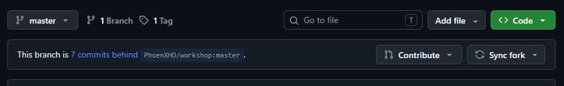

# Project 0: Setup

> - **What you'll learn:** Version control (Craft)
> - **Achievements in this project:** 1
> - **Covers:** Windows, macOS, and Linux

This project covers the one-time environment setup required before you start coding. You'll create an account, install git and VS Code, copy this repository to your computer, and make your first commit.

Most steps include a checkpoint to verify your setup before moving forward. Platform-specific instructions are clearly labeled for Windows, macOS, and Linux. Follow the section for your operating system and skip the rest.

> [!TIP]
>
> You'll also be clicking around GitHub as you read, so it helps to keep these instructions in one tab and do the clicking in another.

## The steps

1. [Create your GitHub account](#step-1-create-your-github-account)
2. [Get your own copy](#step-2-get-your-own-copy)
3. [Install git](#step-3-install-git)
4. [Install VS Code](#step-4-install-vs-code)
5. [Get the workshop onto your machine](#step-5-get-the-workshop-onto-your-machine)
6. [Know your way around](#step-6-know-your-way-around)
7. [Start your PROGRESS.md](#step-7-start-your-progressmd)
8. [When new projects appear](#step-8-when-new-projects-appear)
9. [When something goes wrong](#step-9-when-something-goes-wrong)
10. [You're ready](#step-10-youre-ready)

Appendix: [Command cheatsheet](#appendix-command-cheatsheet)

## Step 1: Create your GitHub account

GitHub is a website where programmers keep their code, and it's where this whole workshop lives. Everything you build here will live there too, under your name, so the first thing you need is an account. If you already have one, sign in and skip ahead; nothing else in this step applies to you.

1. Go to [github.com](https://github.com) and click **Sign up**.
2. Enter your email address, create a password, and pick a username.
   - *Note on usernames: Your username will be part of your public GitHub web addresses, like `github.com/yourname`. So make sure to pick something you wouldn't mind showing a stranger. You can rename things later, but starting with something reasonable saves you the trouble.*
3. Complete the verification steps sent to your email.

Once signed in, click your profile picture in the top-right corner. This menu gives you quick access to your **Profile** and **Repositories** pages. Nearly everything you do on GitHub starts from that corner.


**Checkpoint:** Click your profile picture and select **Profile**. You should see your new GitHub user profile page.

## Step 2: Get your own copy

On GitHub, projects live in **repositories** (or "repos" for short), which store all project files along with a history of changes. This workshop is a repo, and at the moment there is exactly one of it, mine.

To work through this workshop, you'll create a copy of this main repository under your own GitHub account. Creating your own copy is called **forking**. Your fork starts as an exact copy of the original project, but any changes you make to it belong strictly to you.

1. Click the workshop's name at the top of this page to go back to the repository's main page.
2. Click the **Fork** button near the top-right corner of the page.
3. On the configuration page, keep the default settings and click **Create fork**.


After a few seconds, GitHub will redirect you to your new copy. The web address in your browser will now display `github.com/yourname/workshop`. Directly below the repository name, you'll see a label that says *forked from*, showing where your copy originated. That detail matters later, because when I publish new projects or fixes, you'll be able to pull them into your copy.


From this point on, whenever this workshop refers to *your repo*, it means this fork under your account.

**Checkpoint:** your browser's address bar displays `github.com/yourname/workshop`, and the page says *forked from* mine.

## Step 3: Install git

git is the program that runs underneath every repo. It records every change made to the files in it, which is what makes saving progress, viewing history, and undoing mistakes possible. You'll use it constantly from Step 7 onward.

You'll check that it worked from a terminal, a window where you type commands and press Enter instead of clicking. If you've never used one, the Windows and macOS sections below show you how to open it.

### Windows

1. Download the installer from [git-scm.com/install/windows](https://git-scm.com/install/windows).
2. Run the installer and click **Next** through the setup process using the default options.
3. The installation includes **Git Bash**, a terminal for Windows that behaves like the terminals on macOS and Linux. You'll use it briefly in this step, and in Step 7 it moves into VS Code and stays there. To open it, press the **Windows** key and search for it.

### macOS

1. Open a terminal by pressing `Cmd + Space`, typing `Terminal`, and pressing `Enter`.
2. Type `git --version` and press `Enter`.
3. If git isn't installed yet, a window will pop up offering to install the Command Line Developer Tools. That's git. Click **Install** and let it finish, then run the command again.

### Linux

Install git with your distribution's package manager; other distributions are listed at [git-scm.com/install/linux](https://git-scm.com/install/linux). On Ubuntu, for example:

```
sudo apt update && sudo apt install git
```

**Checkpoint:** in a terminal (Git Bash on Windows), typing `git --version` and pressing Enter prints an installed version number.

## Step 4: Install VS Code

**Visual Studio Code (VS Code)** is a code editor, which is a specialized text editor for programming. It colors code so you can tell the parts apart at a glance, it warns you when something looks off, and it can open a whole folder at once and list every file in it down the side of the window. You'll write everything you build in this workshop inside it.

### Windows & macOS

1. Download VS Code from [code.visualstudio.com](https://code.visualstudio.com).
2. On Windows, run the downloaded installer and follow the prompts.
3. On macOS, open the downloaded file and move **Visual Studio Code** into your **Applications** folder.

### Linux

Download the `.deb` package (for Ubuntu/Debian) or `.rpm` package (for Fedora/RHEL) from [code.visualstudio.com/download](https://code.visualstudio.com/download) and install it using your software manager.

**Checkpoint:** Launch VS Code on your computer. You can close the default Welcome tab once the editor opens.

## Step 5: Get the workshop onto your machine

Your fork currently lives on GitHub's servers. To work on exercises locally, you need a copy on your computer. In git terms, downloading a local copy connected to your GitHub repository is called **cloning**.

### 1. Copy your repository web address

1. Open your fork on GitHub (`github.com/yourname/workshop`).
2. Click the green **Code** button.

   

3. Under the **HTTPS** tab, copy the web address (it ends in `.git`).

### 2. Clone using VS Code

1. Open VS Code.
2. Click the **Source Control** icon on the left sidebar (it looks like a branching node).

   

3. Click **Clone Repository**.
4. Paste the address you copied into the prompt at the top of VS Code and press **Enter**.
5. Select a location for the project that you'll remember later (such as your `Documents` or `Projects` folder). VS Code will create a new subfolder named `workshop` inside that location.
6. When prompted, click **Open** to open the cloned folder in VS Code.

**Checkpoint:** In VS Code, click the **Explorer** icon (top item on the left sidebar). The workshop's files should be listed there.

## Step 6: Know your way around

Take a moment to review the project layout in the VS Code Explorer panel. Don't worry if there are too many files. Here is a breakdown:

- **Project folders (`0-setup`, `1-beginner`, `2-intermediate`, `3-advanced`):** Each project lives in its own folder, organized by difficulty.
- **`README.md`:** The welcome page and main overview for the workshop.
- **`INDEX.md`:** The complete project catalog listing all available exercises.
- **`PROGRESS.md.template`:** The starter template you will use in Step 7 to create your personal progress log.
- **`LICENSE` & `.gitignore`:** Standard configuration files that manage permissions and tell git which system files to ignore.

> [!TIP]
>
> Keep these pages open in your web browser on GitHub, where the formatting and collapsible sections display correctly, and use VS Code for editing code files.

**Checkpoint:** You can locate the project folders (such as `0-setup/`) and the workshop's documentation files in VS Code's Explorer panel.

## Step 7: Start your PROGRESS.md

Now you'll make your first commit. A **commit** is a saved snapshot of your project at a specific point in time. Each commit stores the updated files along with a short descriptive message. That's basically how you save your progress and keep a history of your changes.

### 1. Create `PROGRESS.md`

1. In VS Code's Explorer panel (the panel that lists all the files), right-click `PROGRESS.md.template` and select **Copy**.
2. Right-click the empty space in the file list and select **Paste**.
3. Right-click the new file (`PROGRESS.md copy.template`), select **Rename**, and change the name to `PROGRESS.md`.

### 2. Open the terminal in VS Code

1. Press `` Ctrl + ` `` (or select **Terminal > New Terminal** from the top menu). A terminal panel opens at the bottom of VS Code.
2. The line that ends with a `$` is the **prompt**. It shows the **directory** (the terminal's word for a folder) you're currently in, and it's where your typed commands appear. VS Code's terminal always starts in the folder the window has open, so the prompt here ends in `workshop`, and every command you type runs in the right place. If you're ever unsure, run `pwd` (short for *print working directory*) and the terminal prints the full path of the directory you're in.
3. **Windows users:** Click the small dropdown arrow next to the `+` icon in the terminal panel and select **Git Bash**. You can also choose **Select Default Profile** to make Git Bash your default terminal in VS Code.

   

### 3. Save your changes with git

In the terminal, run the following three commands one by one (press Enter after each):

```
git add PROGRESS.md
git commit -m "Start my PROGRESS.md"
git push
```

- `git add` **stages** the file, adding it to the list of changes to save.
- `git commit -m "..."` creates a saved snapshot with your message.
- `git push` uploads your local commits to your fork on GitHub. The first time you run it, a browser window or prompt may ask you to sign in to GitHub to authorize VS Code.

> [!NOTE]
>
> Your changes stay on your computer until you run `git push`. `git commit` alone doesn't upload anything.

If the three commands are blurring together, don't worry about memorizing them. You'll run these exact lines at the end of nearly every exercise from here on, and every project page repeats them when they're needed.

One more thing: the Source Control panel from Step 5 can do all of this with clicks. Changed files appear in its list, there's a box for your message, and a button that commits. The same panel also handles pulling updates (Step 8) and discarding changes (Step 9), so nearly everything git-related in this workshop can be done without the terminal. It's the same git underneath, so type or click whichever suits you.

Now refresh your fork's page on GitHub and look at the file list.

> ✦ **Achievement unlocked: First Commit**
>
> This is the one achievement hiding in this project, and it's yours now. Add this line to the Achievements section of your `PROGRESS.md`:
>
> `- ✦ First Commit (Project 0)`

**Checkpoint:** Refresh your fork's page on GitHub (`github.com/yourname/workshop`). You should see `PROGRESS.md` listed among the files, with the commit message *Start my PROGRESS.md*.

## Step 8: When new projects appear

As new projects or updates are added to the main workshop, you can pull those changes into your own copy. The *forked from* label you saw in Step 2 is how your copy knows where it came from, and it's what makes this possible. You don't have to remember these steps now; skip them and come back whenever you need them.

### 1. Update your GitHub fork

To check for new material, go to your repo's page on GitHub. If your fork is behind mine, GitHub says so and offers a **Sync fork** button; click it, then click **Update branch**. Your files and the workshop's never overlap, so syncing can't touch your work.



### 2. Update your local files

To bring those updates from GitHub down to your computer, open the terminal in VS Code and run:

```
git pull
```

- `git push` sends your work **up** to GitHub.
- `git pull` fetches updates **down** to your computer.

### 3. Stay notified

You don't have to check by hand. On the workshop's original repo (the one in your *forked from* label), click the **Watch** button near the top right, choose **Custom**, and tick **Releases**. From then on, whenever a new version of the workshop is published, GitHub notifies you through the bell icon next to your profile picture, and the [changelog](../CHANGELOG.md) says what arrived.

## Step 9: When something goes wrong

At some point you'll open a workshop page, poke at it, and save something you shouldn't have. That's fine. That's what git is for anyway.

To restore a file to its original state:

1. Open the **Source Control** panel on the left sidebar in VS Code.
2. Find the modified or deleted file in the list.
3. Hover over the file name and click the **Discard Changes** icon (the curved undo arrow).

   

4. Confirm the prompt, and the file returns to its last committed state.

> [!CAUTION]
>
> Discarding changes permanently removes unsaved edits. Only use this on workshop files you want to reset; on your own unfinished work, it throws the work away.

## Step 10: You're ready

You now have a complete development setup: a GitHub account, a personal repository fork, a local clone, VS Code with an integrated terminal, and your first published commit.

Hopefully, you're now a little familiar with how git, GitHub, VS Code, and terminals work.

There's just one last thing to do. Open your `PROGRESS.md` and give the Craft section its first entry, the skill this project promised:

```
Version control
```

The template shows exactly where it goes. From the next project on, finishing one ends like this: new lines in your `PROGRESS.md`, new skills under their categories.

Then save the file and upload your changes:

```
git add PROGRESS.md
git commit -m "Add version control to my PROGRESS.md"
git push
```

Project 1 is a small game, and you're ready for it.

## Appendix: Command cheatsheet

Every command this project taught you, one line each. Each project's page ends with one of these as a running review, and the list grows as you learn more.

| Command | What it does | Learned in |
|---------|--------------|------------|
| `git --version` | Print the installed git version | Step 3 |
| `pwd` | Print the directory your terminal is in | Step 7 |
| `git add <file>` | Stage a file to be saved | Step 7 |
| `git commit -m "..."` | Save a snapshot with your message | Step 7 |
| `git push` | Upload your commits to GitHub | Step 7 |
| `git pull` | Download new updates from GitHub | Step 8 |

A few more worth knowing, even though this project didn't need them:

| Command | What it does |
|---------|--------------|
| `cd <folder>` | Move the terminal into a folder |
| `cd ..` | Move up one folder |
| `ls` | List the files in the current folder |
| `rm <file>` | Delete a file permanently |

---

[Next project](../1-beginner/01-clicker-game/) · [Project hub](../INDEX.md)
